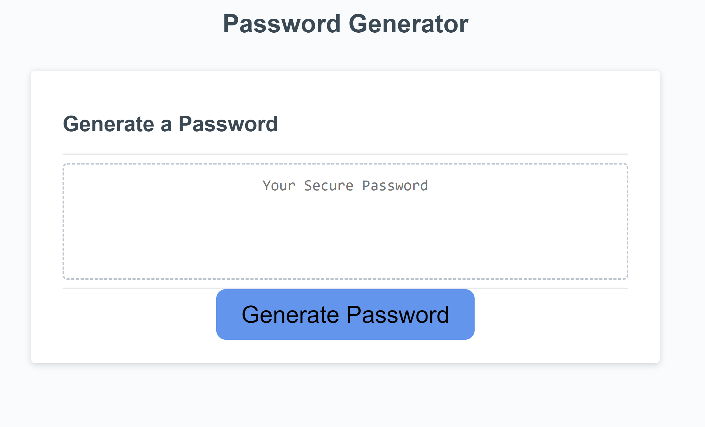
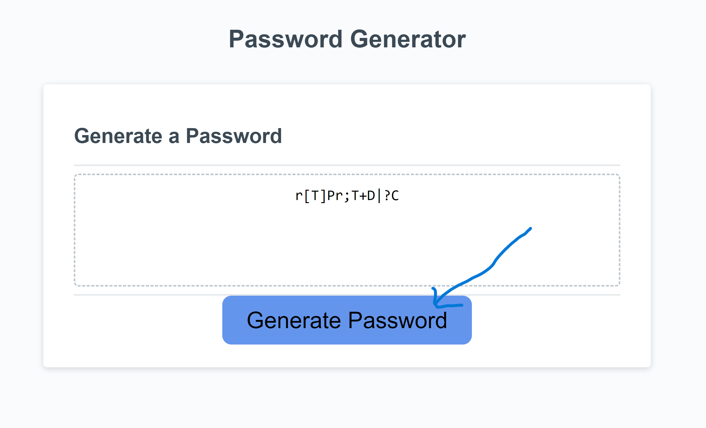
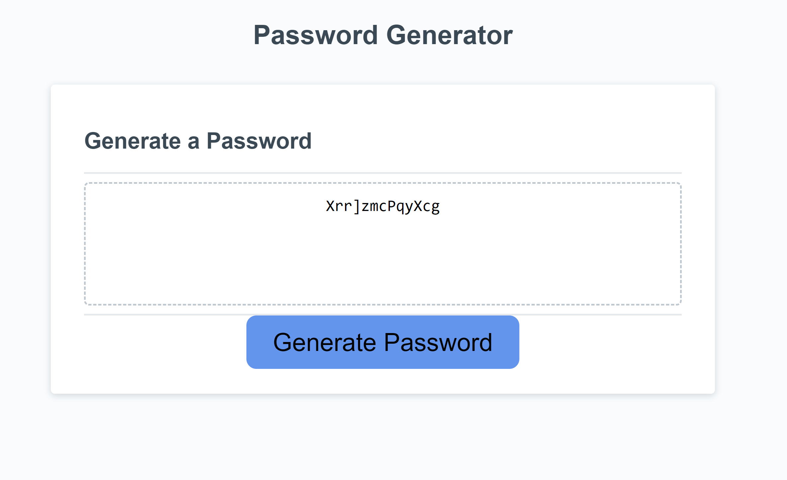

# - Javascript Password Generator

Description: This tool will generate a random password when the "Generate Password" button is clicked. This will be executed using Javascript.
The password will contain 13 characters using uppercase and lowercase letters, as well as special characters.

**Table of Contents:** 

-Installation 

-Usage 

-Credits 

-License

-Badges

-Tests

**Installation:** Uploaded to online repository via git bash and github

**Usage:** 

When the page is opened box will display "Your Secure Password".

This tool will then generate a random password when the "Generate Password" button is clicked.

The tool will then make infinite random password whenever button is clicked.

**Credits:** Jermaine Rayner edx codecamp

**License:** n/a

**Badges:** n/a

**Tests:** Multiple trail and error tests whilst coding tool.
